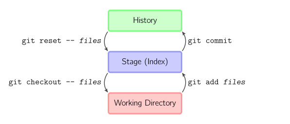

Intro to Git
============

---

Why version control?
---------

- `cp myproject myproject-backup-17` is lame.
- collaborate
- share your code
- keep project history
- be proffessional

---

Let's make a git repo!
----------------------

- Visit [https://github.com/new](https://github.com/new)
- Make the repository name "calc".
- Click "Create Repository"

---

Let's make a git repo!
----------------------

I sent calc-git.tar.gz in an email, and I assume it is in your home directory.

    !bash
    cd ~
    tar -xzf calc-git.tar.gz
    cd calc
    git init
    ls -la
    git add slides .gitignore README.md calc.py calc_tests.py
    git commit -m 'first commit'
    # replace JeffAMcGee with your github username
    git remote add origin https://github.com/JeffAMcGee/calc.git
    git push -u origin master

Your code is now safely stored in the public git repo.

---

Let's change the code.
----------------------

Let's add a feature: multiplication.

    !bash
    git status
    vi calc.py # add multiplication operator
    git status
    git diff
    git add calc.py
    git status
    git commit -m 'add support for multiplication'
    git status

Since we haven't written any tests for it yet, let's not push this code.

---

What did `git add` do?
----------------------

`git add` tells git what files to commit when you run `git commit`.

.notes: The illustration is copyright Mark Lodato and is licensed under the CC BY-NC-SA 3.0 license.) http://marklodato.github.com/visual-git-guide/index-en.html

---

Want to work on another machine?
--------------------------------

Let's simulate that by cloning a copy of the repo in a new directory.

    !bash
    mkdir ~/server
    cd ~/server
    # replace JeffAMcGee with your github username
    git clone https://github.com/JeffAMcGee/calc.git
    cd calc
    vi calc.py # add division operator
    git commit -am 'add support for division'
    git push

The calculator on github now supports addition, subtraction and division.

---

Merge Conflicts?
----------------

Sometimes two people change the same file. Git tries to be smart, but sometimes
you have to fix it.

    !bash
    cd ~/calc
    git pull
    git status
    vi calc.py
    git status
    git add calc.py
    git status
    # let's look at the commits in a GUI
    git commit
    git push

---

Commits form a DAG
------------------

- normal commits have one parent
- merge commits have multiple

---

More Cool Stuff
---------------

- `branch` - create experimental branch
- `merge` - combine branches back together
- `blame <file>` - look at the history of a file
- `stash` - temporarilly rollback the current changes
- `commit -amend` - fix the previous commit
- `checkout <file>` - revert uncommitted changes
- `reset <file>` - revert committed changes
- `help <command>` - help on a command
- and there's a lot more...

---

Tips
----

- Write real commit messages.
- If you commit broken code, say so.
- Don't push broken code.
- When you fix a merge conflict, don't do anything else.
- Use ssh keys to avoid typing your password.
- Want pretty colors? Edit `~/.gitconfig` .
- Use .gitignore to keep gunk out of the repo.
- If `git help` doesn't work, ask the [oracle](http://google.com/). It knows.

---

Questions?
==========
